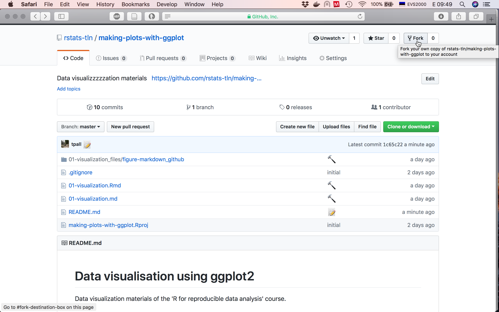

# Fork and clone repo to Rstudio

- Found interesting R project on GitHub and want to collaborate, contribute or play around with it but you don't know how to get this thing into your computer?

- Second scenario where you can also apply most of the steps of this tutorial is when you want to use GitHub git repo for version control of your new R project. Easiest way to do this is to start from GitHub.

## Introduction
This tutorial describes steps how to **fork** someones repo from GitHub and then **clone** and open this repo in your Rstudio session.
Deeper and wider insight into git and GitHub for **begginners** with more use cases and **troubleshooting** is available at http://happygitwithr.com by Jenny Bryan. 

Please also have a look at the ["Why.." chapters](http://happygitwithr.com/big-picture.html#why-git), because it's definitely question that might arise in one's head. Do I really need to make my life unnecessary complicated with all this version control stuff and command line? Well, wait until you can see forest behind the trees: uploading your work to online repo hosting services (GitHub, Bitbucket, GitLab) provides you with easy access to sharing and disseminating your work and makes you visible. You can start blogging and even publish a book! All this is on top of clutter-free and transparent version control.

## Prerequsites
We assume you have R and Rstudio installed to your computer. Then you need to have [GitHub account](http://happygitwithr.com/github-acct.html) and [git installed to your computer](http://happygitwithr.com/install-git.html) and you must [introduce yourself to git](http://happygitwithr.com/hello-git.html).

## Steps
You can start with repo that is already present on GitHub

1. Fork your repo of interest or create a new empty repo.
      (A) To fork a repo, click on the **Fork** button located in upper right corner of the repo page. GitHub starts process of copying this repo to your account.

      (B) To create a new repo, find a plus sign :plus-sign: on your GitHub account page upper right corner between a bell :bell: and your avatar :squirrel:.

